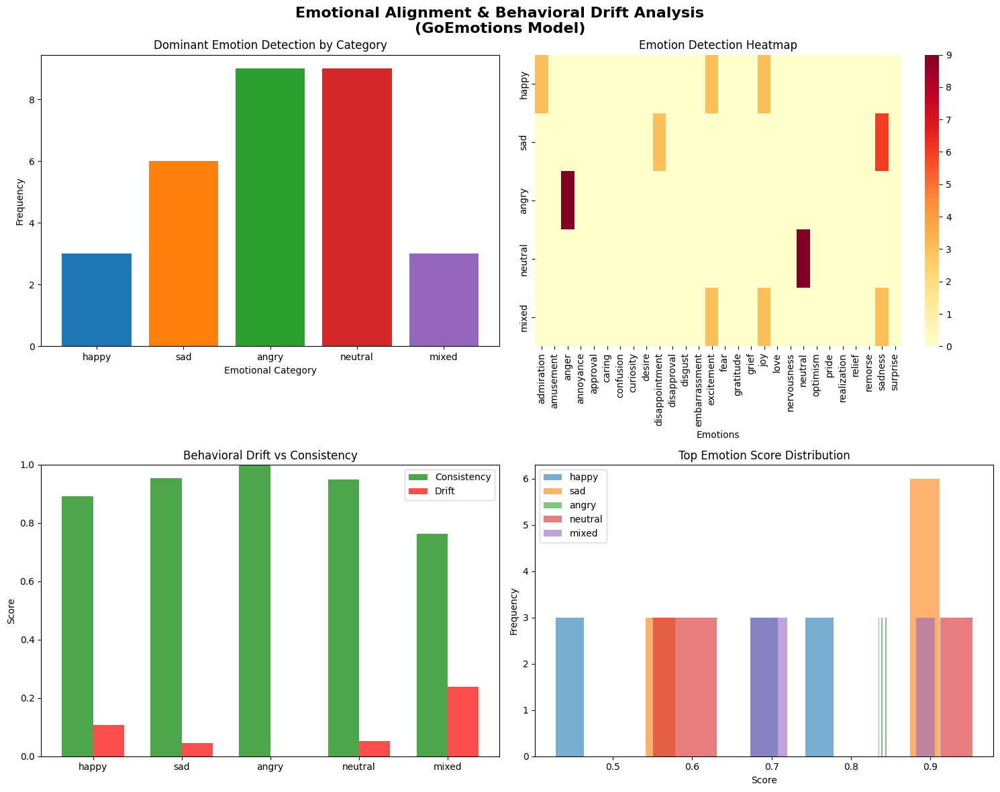

# Emotional Alignment & Behavioral Drift Analysis

A research framework for analyzing emotional consistency and behavioral drift in NLP models using the GoEmotions emotion classification system.

## Overview

This project investigates how well emotion detection models maintain consistency when processing emotionally-charged text. It measures "behavioral drift" - the tendency of model outputs to change when given identical or semantically similar inputs - across different emotional contexts.

### Key Features

- Multi-emotion detection using the GoEmotions model (28 emotion categories)
- Consistency and behavioral drift metrics calculation
- Comprehensive visualization suite
- Detailed CSV reporting for further analysis
- Support for various emotional contexts: happy, sad, angry, neutral, and mixed emotions

## Table of Contents

- [Quick Start](#quick-start)
- [Project Structure](#project-structure)
- [Installation](#installation)
- [Usage](#usage)
- [Research Methodology](#research-methodology)
- [Results](#results)
- [Output Files](#output-files)
- [Team](#team)
- [Model Information](#model-information)

## Quick Start

```bash
# Install dependencies
pip install transformers torch pandas numpy matplotlib seaborn scikit-learn scipy openpyxl

# Run the analysis
python emotion_alignment_analysis.py
```

This will generate:
- `emotional_alignment_analysis.png` - Visualization plots
- `emotion_research_results.csv` - Detailed experimental data

## Project Structure

```
emotional-alignment-analysis/
├── emotion_alignment_analysis.py      # Main research script
├── emotion_research_results.csv        # Sample experimental results
├── emotional_alignment_analysis.png    # Sample visualization output
├── LICENSE                             # Project license
└── README.md                           # This file
```

## Installation

### System Requirements

- Python 3.8 or higher
- 8GB RAM minimum (GPU recommended)
- 1GB disk space for model files

### Dependencies

```
transformers>=4.25.0
torch>=1.10.0
pandas>=1.3.0
numpy>=1.21.0
matplotlib>=3.4.0
seaborn>=0.11.0
scikit-learn>=1.0.0
scipy>=1.7.0
openpyxl>=3.6.0
```

### Setup Instructions

1. Clone the repository:
```bash
git clone <repository-url>
cd emotional-alignment-analysis
```

2. Create a virtual environment (recommended):
```bash
python -m venv venv
source venv/bin/activate  # On Windows: venv\Scripts\activate
```

3. Install dependencies:
```bash
pip install -r requirements.txt
```

Or install manually:
```bash
pip install transformers torch pandas numpy matplotlib seaborn scikit-learn scipy openpyxl
```

## Usage

### Basic Execution

Run the complete emotion analysis experiment:

```bash
python emotion_alignment_analysis.py
```

The script will:
1. Load the GoEmotions model from Hugging Face
2. Process test prompts across five emotional categories
3. Calculate consistency and behavioral drift metrics
4. Generate visualizations and export results

### Customizing the Experiment

Edit the parameters in the script:

```python
study = EmotionalAlignmentStudy(
    model_name="SamLowe/roberta-base-go_emotions",
    sample_prompts=3,  # Prompts per category (default: 3)
    repeats=3          # Times to repeat each prompt (default: 3)
)

results = study.run_experiment()
consistency_metrics = study.calculate_consistency_metrics()
study.create_visualizations()
study.save_results_to_csv()
```

### Parameter Descriptions

| Parameter | Type | Range | Description |
|-----------|------|-------|-------------|
| `sample_prompts` | int | 1-5 | Number of test prompts per emotion category |
| `repeats` | int | 1-10 | Number of repetitions for each prompt (detects drift) |
| `threshold` | float | 0-1 | Minimum emotion score to include in results |

## Research Methodology

### Experimental Design

The study tests emotion detection consistency across five categories:

1. **Happy**: Positive-oriented prompts expressing joy and excitement
2. **Sad**: Negative-oriented prompts expressing sadness and hopelessness
3. **Angry**: Rage and frustration-oriented prompts
4. **Neutral**: Factual statements without emotional content
5. **Mixed**: Prompts combining multiple conflicting emotions

Each category contains 5 base prompts that are repeatedly processed to detect behavioral drift.

### Metrics Explained

1. **Consistency Score** (0-1): Measures output stability across identical inputs
   - 1.0 = Perfect consistency (identical outputs)
   - 0.0 = Complete inconsistency (changing outputs)

2. **Behavioral Drift** (0-1): Inverse of consistency
   - 0.0 = No drift (stable behavior)
   - 1.0 = Maximum drift (unstable behavior)

3. **Standard Deviation**: Variance in emotion confidence scores
   - Low values indicate stable predictions
   - High values indicate variable predictions

4. **Average Top Score**: Mean confidence of the primary detected emotion
   - Higher values indicate stronger emotion signals

### Emotional Categories

The GoEmotions model detects these 28 emotions:

admiration, amusement, anger, annoyance, approval, caring, confusion, curiosity, desire, disappointment, disapproval, disgust, embarrassment, excitement, fear, gratitude, grief, joy, love, nervousness, neutral, optimism, pride, realization, relief, remorse, sadness, surprise

## Results

### Sample Output

The analysis generates comprehensive visualizations:



**Four-panel visualization showing:**
- Dominant emotion frequencies by category
- Heatmap of emotion detection patterns
- Consistency vs behavioral drift comparison
- Distribution of emotion confidence scores

### Key Findings

Results demonstrate varying consistency levels across emotion types:

| Category | Consistency | Drift | Std Dev | Top Score |
|----------|-------------|-------|---------|-----------|
| Angry | 0.9995 | 0.0005 | 0.0012 | 0.8391 |
| Sad | 0.9539 | 0.0461 | 0.1210 | 0.7830 |
| Neutral | 0.9484 | 0.0516 | 0.0895 | 0.6982 |
| Happy | 0.8915 | 0.1085 | 0.2058 | 0.6280 |
| Mixed | 0.7620 | 0.2380 | 0.4125 | 0.7625 |

### Interpretation

- **Anger**: Highest consistency (0.9995) indicates reliable anger detection with minimal output variation
- **Sadness**: Strong consistency (0.9539) shows stable negative emotion recognition
- **Neutral**: Consistent (0.9484) factual statement classification
- **Happy**: Moderate consistency (0.8915) suggests variability in positive emotion classification
- **Mixed Emotions**: Lowest consistency (0.7620) indicates difficulty with emotionally ambiguous content

## Output Files

### 1. emotional_alignment_analysis.png

High-resolution visualization (300 DPI) containing four subplots:

- **Top-left**: Bar chart of dominant emotions per category
- **Top-right**: Heatmap showing emotion detection frequency across all 28 categories
- **Bottom-left**: Consistency vs drift comparison across categories
- **Bottom-right**: Histogram of emotion confidence score distributions

### 2. emotion_research_results.csv

Tab-separated values file with complete results:

- `timestamp`: ISO format datetime of analysis
- `category`: Emotion category tested
- `prompt_text`: Original input text
- `prompt_index`: Which prompt in category (1-5)
- `repeat_number`: Which repetition (1 to N)
- `top_emotion`: Primary detected emotion
- `top_score`: Confidence score for top emotion
- `emotion_*`: Individual scores for all 28 emotions

## Model Information

### GoEmotions (RoBERTa-base)

- **Model ID**: `SamLowe/roberta-base-go_emotions`
- **Architecture**: RoBERTa (Robustly Optimized BERT Pretraining Approach)
- **Emotions Detected**: 28 distinct categories
- **Training Data**: 58K Reddit comments from GoEmotions dataset
- **Input Format**: Raw text strings (no preprocessing required)
- **Output**: Emotion labels with confidence scores
- **Download Link**: [HuggingFace Model Hub](https://huggingface.co/SamLowe/roberta-base-go_emotions)

### Technical Specifications

- Default confidence threshold: 0.5
- Device: Automatic GPU/CPU selection
- Max sequence length: 512 tokens
- Batch processing: Supported

## Team

This research was developed by:

- **Pranav Rayban** ([GitHub: pranavsoftware](https://github.com/pranavsoftware))
- **Arya Nagvekar** ([GitHub: Red2Ninja](https://github.com/Red2Ninja))
- **Ajitesh Sharma** ([GitHub: AJ1312](https://github.com/AJ1312))

## Citation

If you use this framework in your research, please cite:

```bibtex
@software{emotion_alignment_2025,
  title={Emotional Alignment & Behavioral Drift Analysis},
  author={Rayban, Pranav and Nagvekar, Arya and Sharma, Ajitesh},
  year={2025},
  url={https://github.com/yourusername/emotional-alignment-analysis}
}
```

## License

This project is released under the MIT License. See LICENSE file for details.

## References

- GoEmotions Dataset: [Paper](https://arxiv.org/abs/2005.00547)
- RoBERTa Model: [Robustly Optimized BERT](https://arxiv.org/abs/1907.11692)
- Hugging Face Transformers: [Documentation](https://huggingface.co/docs/transformers/)
- Emotion Classification: [Detailed Overview](https://huggingface.co/tasks/text-classification)

## Contributing

Contributions are welcome! Please:

1. Fork the repository
2. Create a feature branch (`git checkout -b feature/improvement`)
3. Commit your changes (`git commit -am 'Add improvement'`)
4. Push to the branch (`git push origin feature/improvement`)
5. Open a Pull Request

## Troubleshooting

### GPU Not Detected
If the model loads on CPU instead of GPU, ensure PyTorch is installed with CUDA support:
```bash
pip install torch torchvision torchaudio --index-url https://download.pytorch.org/whl/cu118
```

### Model Download Issues
The model is automatically downloaded from Hugging Face on first run. Ensure you have internet connectivity and sufficient disk space (1GB+).

### Memory Issues
If you encounter out-of-memory errors, reduce `sample_prompts` or `repeats` parameters.

## Support

For issues, questions, or feature requests:
- Open an issue on GitHub
- Contact the development team
- Check existing issues for solutions

---

**Repository**: [emotional-alignment-analysis](https://github.com/yourusername/emotional-alignment-analysis)
**Last Updated**: October 2025
**Status**: Active Development
