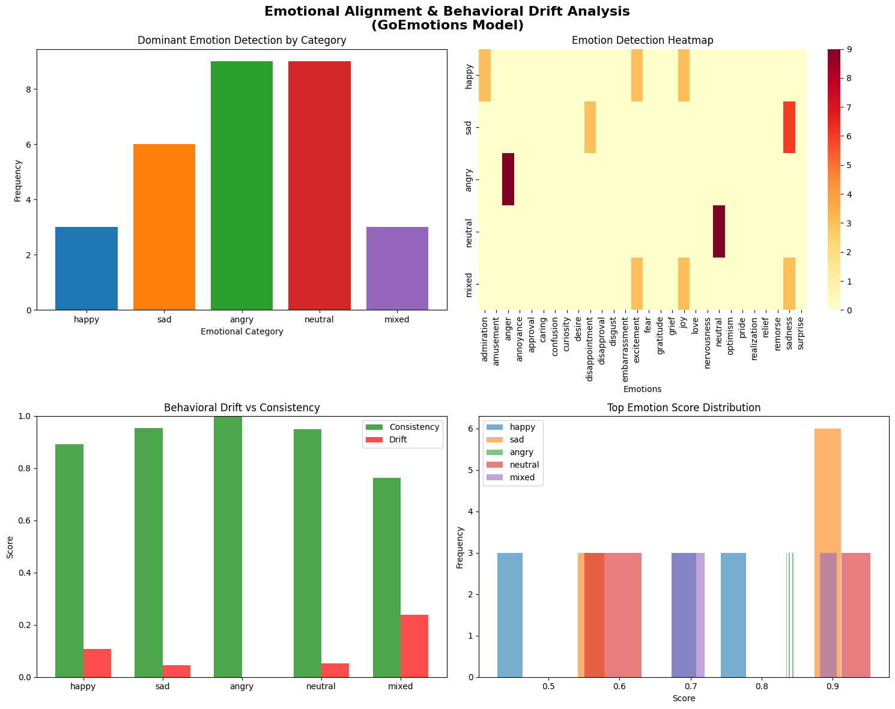

# Emotional Alignment & Behavioral Drift Analysis

A research framework for analyzing emotional consistency and behavioral drift in NLP models using the GoEmotions emotion classification system.

## Overview

This project investigates how well emotion detection models maintain consistency when processing emotionally-charged text. It measures "behavioral drift" - the tendency of model outputs to change when given identical or semantically similar inputs - across different emotional contexts.

### Key Features

- Multi-emotion detection using the GoEmotions model (28 emotion categories)
- Consistency and behavioral drift metrics calculation
- Comprehensive visualization suite
- Detailed CSV reporting for further analysis
- Support for various emotional contexts: happy, sad, angry, neutral, and mixed emotions

## Table of Contents

- [Project Structure](#project-structure)
- [Installation](#installation)
- [Usage](#usage)
- [Research Methodology](#research-methodology)
- [Results](#results)
- [Output Files](#output-files)
- [Team](#team)
- [Model Information](#model-information)

## Project Structure

```
.
├── emotion_alignment_analysis.py    # Main research script
├── emotion_research_results.csv      # Detailed experimental results
├── emotional_alignment_analysis.png  # Visualization output
└── README.md                         # This file
```

## Installation

### Requirements

- Python 3.8+
- PyTorch
- Hugging Face Transformers
- Pandas, NumPy, SciPy, Scikit-learn
- Matplotlib, Seaborn

### Setup

```bash
# Install required packages
pip install transformers torch pandas numpy matplotlib seaborn scikit-learn scipy openpyxl

# Clone or download this repository
git clone <repository-url>
cd emotional-alignment-analysis
```

## Usage

### Basic Execution

```python
# Run the complete research experiment
python emotion_alignment_analysis.py
```

### Customizing Parameters

Modify the study initialization parameters to adjust the experiment:

```python
study = EmotionalAlignmentStudy(
    model_name="SamLowe/roberta-base-go_emotions",
    sample_prompts=3,  # Number of prompts per category
    repeats=3          # Number of times to repeat each prompt
)
```

### Key Parameters

| Parameter | Type | Description | Default |
|-----------|------|-------------|---------|
| `model_name` | str | HuggingFace model identifier | `SamLowe/roberta-base-go_emotions` |
| `sample_prompts` | int | Number of test prompts per emotion category | 3 |
| `repeats` | int | Number of times to process each prompt | 3 |

## Research Methodology

### Experimental Design

1. **Prompt Generation**: Five emotion categories with 5 test prompts each
   - Happy: Positive-oriented prompts
   - Sad: Negative-oriented prompts
   - Angry: Rage and frustration-oriented prompts
   - Neutral: Factual, non-emotional statements
   - Mixed: Prompts combining multiple emotions

2. **Emotion Detection**: Each prompt is processed multiple times through the GoEmotions model to detect emotional content across 28 emotion categories

3. **Metrics Calculation**:
   - **Consistency Score**: Measures the stability of emotion detection across identical prompts
   - **Behavioral Drift**: Inverse of consistency; indicates deviation between repeated runs
   - **Standard Deviation**: Variance in emotion scores across samples
   - **Top Emotion Score**: Average confidence of the primary detected emotion

### Emotional Categories Detected

The GoEmotions model detects 28 distinct emotions:

admiration, amusement, anger, annoyance, approval, caring, confusion, curiosity, desire, disappointment, disapproval, disgust, embarrassment, excitement, fear, gratitude, grief, joy, love, nervousness, neutral, optimism, pride, realization, relief, remorse, sadness, surprise

## Results

### Sample Output Visualization



### Key Findings

The analysis demonstrates the following consistency metrics across emotion categories:

| Category | Consistency Score | Behavioral Drift | Std Deviation | Avg Top Score |
|----------|-------------------|------------------|---------------|---------------|
| Angry | 0.9995 | 0.0005 | 0.0012 | 0.8391 |
| Sad | 0.9539 | 0.0461 | 0.1210 | 0.7830 |
| Neutral | 0.9484 | 0.0516 | 0.0895 | 0.6982 |
| Happy | 0.8915 | 0.1085 | 0.2058 | 0.6280 |
| Mixed | 0.7620 | 0.2380 | 0.4125 | 0.7625 |

#### Interpretation

- **Anger Detection**: Demonstrates the highest consistency (0.9995) with minimal drift, suggesting the model is highly reliable for detecting angry sentiment
- **Mixed Emotions**: Shows the lowest consistency (0.7620), indicating challenges in detecting complex emotional blends
- **Neutral Content**: Maintains strong consistency (0.9484), reflecting the model's ability to distinguish factual statements
- **Happy/Positive Content**: Moderate consistency (0.8915) suggests variability in how positive emotions are classified

## Output Files

### 1. `emotional_alignment_analysis.png`

Four-panel visualization containing:

- **Dominant Emotion Detection by Category**: Bar chart showing frequency of primary emotions detected per category
- **Emotion Detection Heatmap**: Heatmap visualization of emotion frequencies across all categories and detected emotions
- **Behavioral Drift vs Consistency**: Comparative bar chart showing drift and consistency scores by category
- **Top Emotion Score Distribution**: Histogram displaying the distribution of primary emotion scores

### 2. `emotion_research_results.csv`

Detailed results file containing:

- Timestamp of each analysis
- Emotion category
- Full prompt text
- Prompt index and repeat number
- Top detected emotion and its confidence score
- Individual scores for all 28 emotion categories

## Model Information

### GoEmotions Model

- **Model Name**: `SamLowe/roberta-base-go_emotions`
- **Base Architecture**: RoBERTa (Robustly Optimized BERT)
- **Emotions**: 28 distinct emotional categories
- **Training Data**: GoEmotions dataset (58K Reddit comments)
- **Performance**: State-of-the-art for emotion classification on social media text
- **Download**: [HuggingFace Model Hub](https://huggingface.co/SamLowe/roberta-base-go_emotions)

### Model Parameters

- Default emotion threshold: 0.5
- Device: GPU (if available) or CPU
- Tokenizer: RoBERTa tokenizer
- Input: Text strings of arbitrary length

## Team

This research was conducted by:

- **Pranav Rayban** - [GitHub](https://github.com/pranavsoftware)
- **Arya Nagvekar** - [GitHub](https://github.com/Red2Ninja)
- **Ajitesh Sharma** - [GitHub](https://github.com/AJ1312)

## Requirements

### Dependencies

```
transformers>=4.25.0
torch>=1.10.0
pandas>=1.3.0
numpy>=1.21.0
matplotlib>=3.4.0
seaborn>=0.11.0
scikit-learn>=1.0.0
scipy>=1.7.0
openpyxl>=3.6.0
```

## License

This project is provided as-is for research and educational purposes.

## Contributing

Contributions are welcome. Please feel free to submit pull requests or open issues for bugs and feature requests.

## Citation

If you use this research framework in your work, please cite:

```
Emotional Alignment & Behavioral Drift Analysis
Pranav Rayban, Arya Nagvekar, Ajitesh Sharma
2025
```

## References

- GoEmotions Model: [Paper](https://arxiv.org/abs/2005.00547)
- RoBERTa: [Robustly Optimized BERT](https://arxiv.org/abs/1907.11692)
- HuggingFace Transformers: [Documentation](https://huggingface.co/docs/transformers/)

## Support

For questions or issues, please contact the project team or open an issue in the repository.

---

**Last Updated**: October 2025
